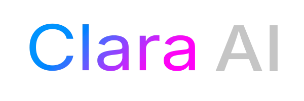

# Clara AI — Assistant IA multi-tenant

<p align="center">
  
</p>

[](LICENSE)

**Clara AI** est une plateforme web d’assistant conversationnel IA en **architecture multi-composants** :

- **Clara** (`clara-ai/`) : application Next.js (frontend + API tRPC), authentification, gestion des conversations et des modèles, base PostgreSQL (Prisma), stockage MinIO. Le chat et le RAG sont délégués au moteur Archibald.
- **Archibald** (`archibald/`) : API FastAPI (Python) qui centralise les appels LLM (OpenAI, Mistral, Anthropic, Google), le RAG (pgvector), le traitement de documents et la recherche web (Tavily). Clara s’y connecte via `ARCHIBALD_API_URL` et `ARCHIBALD_API_KEY`.

RAG (embeddings, recherche vectorielle) et abonnements/quotas sont gérés en base ; pas de paiement en ligne dans cette version.

Ce dépôt est conçu pour être **simple à mettre en place** : un seul fichier `.env` à la racine (voir `.env.exemple`), à remplir puis exécuter `./start.sh` — et Clara tourne en prod sur votre machine. Un recruteur ou un ingénieur peut tester en quelques minutes, comprendre l’architecture via ce README, et consulter les README annexes ([clara-ai/](clara-ai/README.md), [archibald/](archibald/README.md)) pour les détails techniques.

---

## Tester rapidement (Docker)

**Prérequis :** Docker et Docker Compose installés sur la machine.

Un seul fichier d’environnement à la racine, partagé par Clara et Archibald :

1. **Copier le fichier d’exemple**  
   `cp .env.exemple .env`

2. **Remplacer** dans `.env` les valeurs (secrets, clés API LLM si vous voulez tester le chat). Pour un premier test, vous pouvez garder les valeurs par défaut : le script génère `NEXTAUTH_SECRET` et `API_KEY` automatiquement si `.env` est créé à partir de `.env.exemple`.

3. **Lancer le script**  
   `./start.sh`

La stack démarre (PostgreSQL, MinIO, Clara, Archibald), le schéma de base est appliqué. Ouvrez **http://localhost:3000** — Clara tourne en prod sur votre machine.

- Arrêter : `docker compose down`
- Logs : `docker compose logs -f`

_Sous Windows (sans WSL) : copier `.env.exemple` en `.env`, puis `docker compose up -d --build`, puis `docker compose run --rm clara pnpm db:push`._

---

## Vue d’ensemble technique

| Composant      | Rôle                                                                                                                       |
| -------------- | -------------------------------------------------------------------------------------------------------------------------- |
| **Clara**      | SPA + API (Next.js 14, tRPC, Prisma, NextAuth, MinIO). Chat, auth, modèles personnels, , cron, |
| **Archibald**  | API REST (FastAPI) : routes chat par provider/mode, RAG, documents, recherche web. Authentification par `X-API-Key`.       |
| **PostgreSQL** | Données Clara (Prisma), partagé avec Archibald pour le RAG. Extension **pgvector** requise pour les embeddings.            |
| **MinIO**      | Stockage S3-compatible (fichiers uploadés, documents).                                                                     |

Flux typique : l’utilisateur utilise l’UI Clara → requêtes tRPC → Prisma / MinIO ; le chat et le RAG sont envoyés à Archibald, qui lit/écrit en PostgreSQL et MinIO.

---

## Prérequis

- **Clara** : Node.js 18+, pnpm, PostgreSQL (avec `vector`), MinIO.
- **Archibald** : Python 3.12+, uv, PostgreSQL (pgvector), MinIO.
- **Un seul `.env`** à la racine (partagé Clara + Archibald). **Un seul `.venv`** à la racine (Python / uv).
- **Production** : Docker et Docker Compose (voir plus bas).

---

## Installation en développement

### 1. Cloner et préparer l’environnement

```bash
git clone https://github.com/VOTRE_USERNAME/clara-ai.git
cd clara-ai
cp .env.exemple .env
# Éditer .env (racine) : DATABASE_URL, MINIO_*, NEXTAUTH_*, clés API LLM, ARCHIBALD_*, etc.
```

Clara et Archibald chargent automatiquement le `.env` à la racine (pas de `.env` dans `clara-ai/` ni `archibald/`).

### 2. Lancer Clara

PostgreSQL et MinIO doivent être accessibles (local ou Docker).

```bash
cd clara-ai
pnpm install
pnpm db:push
pnpm dev
```

(Next.js + WebSocket sur 3000 et 3001.) Détails : [clara-ai/README.md](clara-ai/README.md).

### 3. Lancer Archibald (moteur IA déporté)

Un seul `.venv` à la racine (workspace uv) :

```bash
# À la racine du dépôt
uv sync
uv run --directory archibald uvicorn app.main:app --reload
```

API sur **http://127.0.0.1:8000**. Dans `.env` à la racine, renseigner `ARCHIBALD_API_URL=http://127.0.0.1:8000` et `ARCHIBALD_API_KEY` (même valeur que `API_KEY`). Détails : [archibald/README.md](archibald/README.md).

---

## Installation sur son serveur (production)

Même principe que « Tester rapidement » : **un seul `.env` à la racine**, puis le script.

1. À la racine : `cp .env.exemple .env`
2. Éditer `.env` avec vos vrais secrets, clés API et URLs de prod (`NEXTAUTH_URL`, `NEXTAUTH_SECRET`, `OPENAI_API_KEY`, etc.). Les valeurs par défaut (postgres, minio comme hostnames) sont prévues pour Docker.
3. `./start.sh` — Clara et Archibald tournent en prod sur votre machine.

Pour un déploiement public, placer un reverse proxy (Nginx, Caddy, Traefik) devant Clara et Archibald, en HTTPS, et adapter `NEXTAUTH_URL` et `CORS_ORIGINS` dans `.env`.

---

## Stack technique (résumé)

| Domaine       | Clara (Next.js)                                       | Archibald (Python)                             |
| ------------- | ----------------------------------------------------- | ---------------------------------------------- |
| Framework     | Next.js 14, React 18, TypeScript                      | FastAPI, Python 3.12+                          |
| API / données | tRPC, Prisma, PostgreSQL, SuperJSON                   | REST, SQLAlchemy/Prisma, PostgreSQL (pgvector) |
| Auth          | NextAuth (Credentials + Google), JWT                  | X-API-Key                                      |
| IA / RAG      | LangChain, embeddings, pgvector (délégué à Archibald) | LangChain, vectorstores, Tavily                |
| Stockage      | MinIO (S3)                                            | MinIO                                          |
| Qualité       | Zod, Vitest, Playwright                               | Pydantic, Ruff, mypy, pytest                   |

---

## Licence

Ce projet est librement **consultable et utilisable** ; une **attribution** est requise. Pour un **usage commercial** ou la **distribution d’un produit basé sur ce code**, merci de **contacter l’auteur**. Voir [LICENSE](LICENSE).
